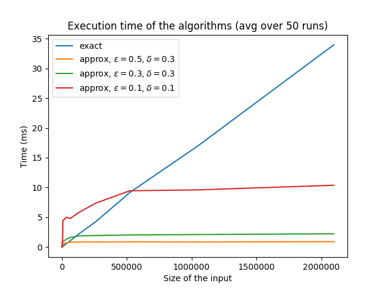
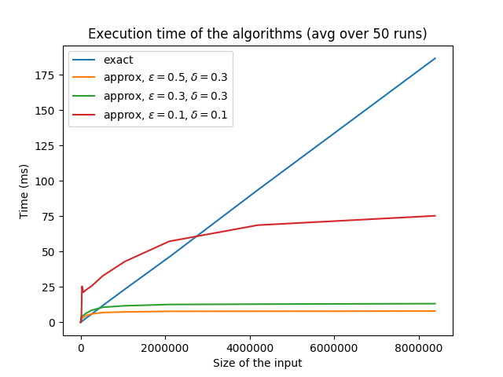

# Property testing of regular languages

Efficient C++ header-contained implementation of a property tester for regular languages 
(i.e. sets of words defined by regular expressions), by Gabriel Bathie.   
This is part of the work I did during my research internship  under the supervision of Tatiana Starikovskaya at ENS Ulm during the summer 2020.  
Our publication with details on the analysis of the algorithm can be found online here (not yet available, todo).

---
### Usage
Simply include `property_tester.h` in your project, and add `nfa.h` and `property_tester.h` to your include path.  
Examples of creation of an NFA and usage of the property testing algorithm can be found in `example.cpp`.  
To compile the example, use  `make example`.

---
### Tests
Here may be found the results of the `tests.cpp` program when compiled and ran on my computer.

Results for the NFA for `0^*1^*`:

Results for a random NFA with `10` states:

As expected, the property testing algorithm is much faster than the exact algorithm 
when the input is large, and tends to a constant time complexity.
The runtime is not exactly constant because letters that appear in multiple samples
are only queried once. The larger the input is, the less overlapping queries there are (on average), 
and therefore the number of queries (and the runtime) increases slightly.

To compile the test program, run `make tests`.
Run the resulting `./tests` file, and then run `python generate_graphs.py` to generate graphs as seen above.

---
### Warnings
When using functions `Nfa::accepts` an `property_test` on literal strings 
(that is characters in between double quotes, e.g. `"Hello world"`), 
one must either convert the literals to `std::strings` explicitely
or explicitely call the functions with the template argument  `Container = std::string`,
otherwise the trailing null character `\0` is added to the literal, which makes the automaton reject.

---